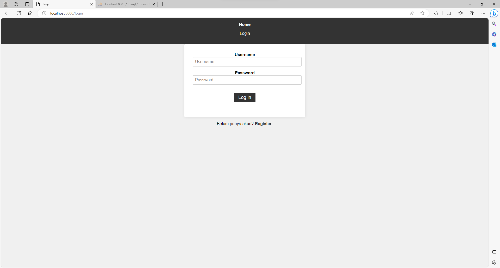
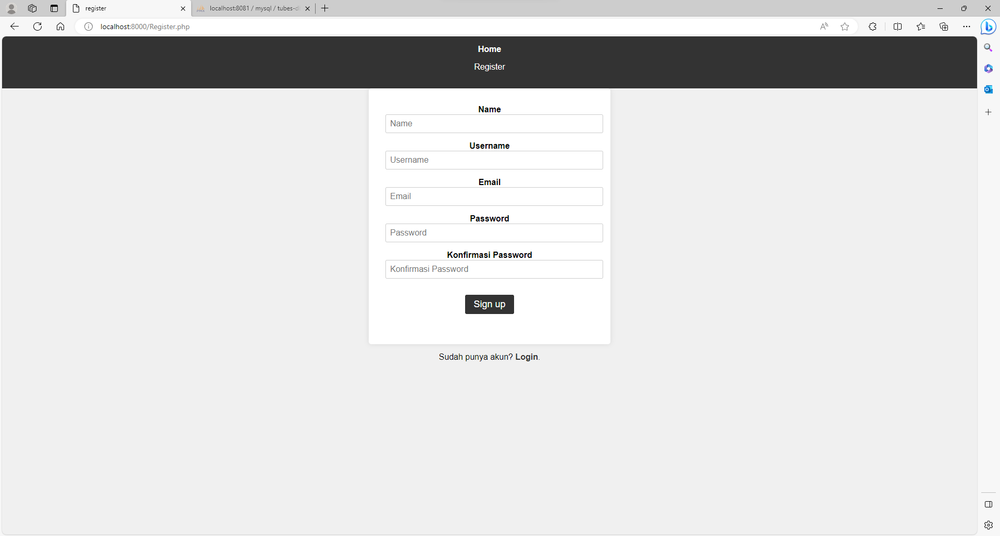
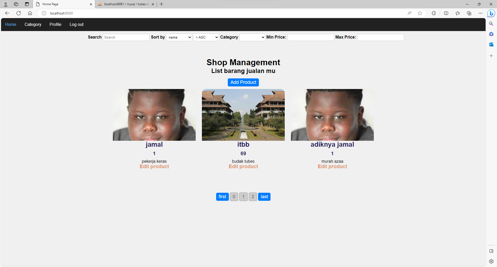
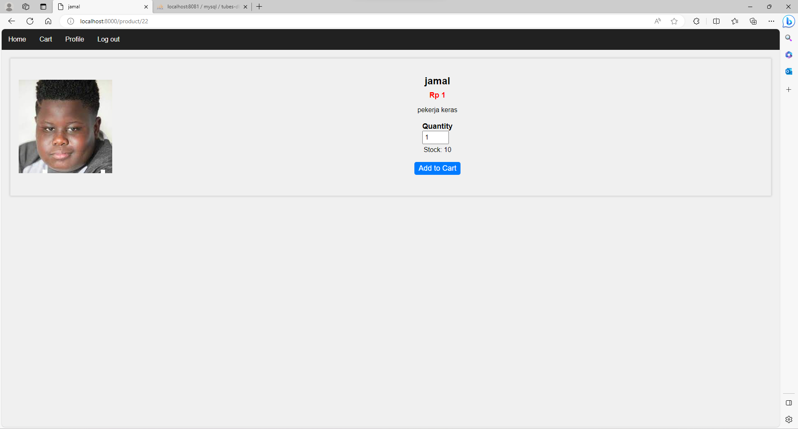
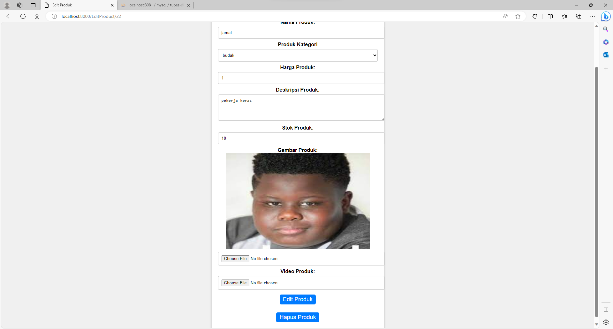
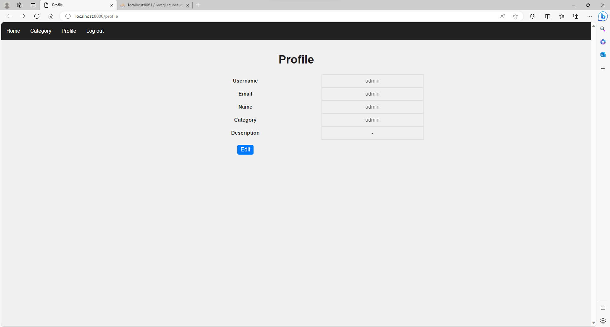
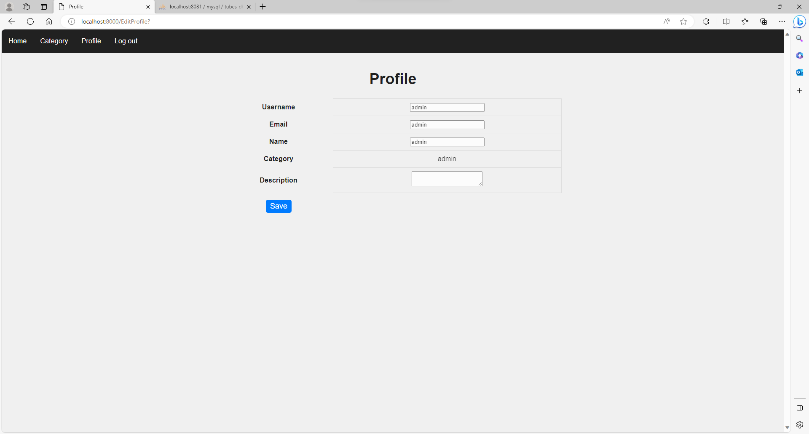
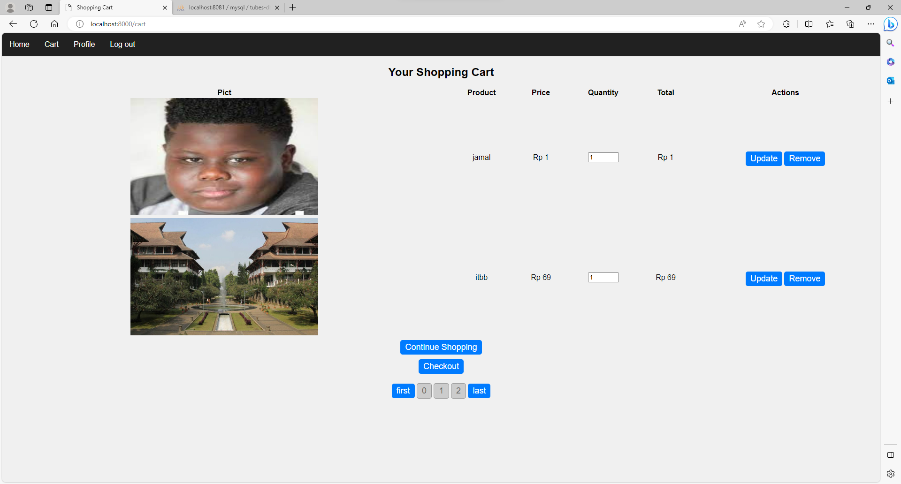
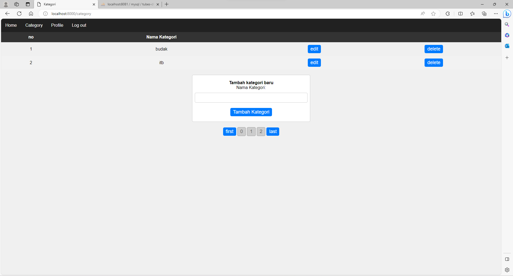

# Tugas Besar 1 - IF3110 Pengembangan Aplikasi Berbasis Web

## Deksripsi Aplikasi Web

Aplikasi web yang dibuat adalah sebuah platform _e-commerce_ sehingga pengguna dapat melakukan pembelian produk secara _online_. Pengguna dapat melakukan pencarian produk. Selain itu, pengguna juga dapat melakukan pembelian produk dengan menambahkannya ke dalam keranjang. Aplikasi web ini juga menyediakan fitur manajemen bagi admin untuk mengelola produk dan kategori.

## Daftar _Requirement_
1. Browser
2. Docker
   
## Cara Instalasi Server

1. _Clone_ repositori ini.

```sh
git clone https://gitlab.informatika.org/if3110-2023-01-36/Tugas-Besar-1.git
```

2. Ubah _current directory_ menjadi folder `Tugas-Besar-1`.

```sh
cd Tugas-Besar-1
```

3. Pastikan telah menginstal dan menjalankan aplikasi Docker.

4. _Build_ kontainer Docker atau jalankan file bat.

```sh
docker build -t tubes-1:latest .
```

```sh
./scripts/build-image.bat
```

4. Buatlah file .env baru berdasarkan .env.example (atau dengan menghapus .example dari nama file).

```sh
mv .env.example .env
```

## Cara Menjalankan Server

1. Jalankan kontainer Docker.

```sh
docker compose up -d
```

2. Akses aplikasi web di localhost dengan _port_ 8000.

```sh
http://localhost:8080/
```

3. Hentikan aplikasi web dengan menjalankan

```sh
docker compose down
```

## _Screenshot_ Tampilan Aplikasi

### Login


### Register


### Home


### Product


### Add Product


### Profile


### Edit Profile


### Cart Profile


### Category Profile


## Pembagian Tugas

**Anggota Kelompok**

| Nama                         | NIM      |
|------------------------------|----------|
| Ulung Adi Putra              | 13521122 |
| Naufal Baldemar Ardanni      | 13521154 |
| Dewana Gustavus Haraka Otang | 13521173 |

**<u>Server-side</u>**

| Fungsionalitas                |           NIM                 |
|-------------------------------|-------------------------------|
|Cart                           | 13521122, 13521154, 13521173  | 
|Category                       | 13521122                      |
|Pagination                     | 13521173                      |
|Login                          | 13521173                      |
|Register                       | 13521173                      |
|Search, sort, filter           | 13521122                      |
|Product                        | 13521122                      |
|Product Files                  | 13521122                      |
|Profile                        | 13521154, 13521173            |
|Debounce                       | 13521173                      |
|Database                       | 13521122                      |
|Routing                        | 13521173                      |
|Home                           | 13521122, 13521173            |

**<u>Client-side</u>**

### _Client Side_
| Fungsionalitas                |           NIM                 |
|-------------------------------|-------------------------------|
|Cart                           | 13521122, 13521154            | 
|Category                       | 13521122, 13521173            |
|Pagination                     | 13521173                      |
|Login                          | 13521173                      |
|Register                       | 13521173                      |
|Search, sort, filter           | 13521122                      |
|Product                        | 13521122                      |
|Product Files                  | 13521122                      |
|Profile                        | 13521154                      |
|Debounce                       | 13521173                      |
|Home                           | 13521122, 13521173            |
|Navbar                         | 13521154                      |
|Styling                        | 13521173                      |
|Responsive                     | 13521122, 13521173            |

### Bonus
| Fungsionalitas                |           NIM                 |
|-------------------------------|-------------------------------|
|Docker                         | 13521173                      |
